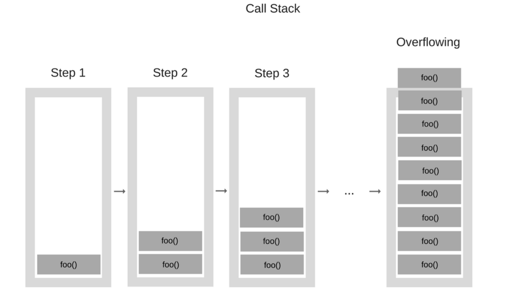

Hace unos días me crucé con un [kata](https://docs.codewars.com/concepts/kata/) en la plataforma de code training [codewars](https://www.codewars.com/about) tagged como _recursion._

¿Qué es recursión, cómo se usa, cuando se usa? Lo vemos

## Introducción

Wikipedia lo define como:

> Recursión o recursividad es la forma en la cual se especifica un proceso basado en su propia definición.

(Casi) siempre las definiciones de una linea de wikipedia no ayudan mucho.

Podemos decir que es uno de los primeros conceptos con los que estudiantes de alguna rama de programación se encuentran. Yo lo encontré en la **primer** materia de la carrera de ciencias de la copmutación de la UBA.

Formalmente podemos decir que es una técnica o método para diseñar algoritmos, en el cual se divide el problema en partes que se repiten muchas veces.

Hay una característica muy llamativa que comparten todos los programas que usan recursión, **se llaman a ellos mismos** 🤯. Veamos un ejemplo:

## Ejemplo. Fibonacci

La [sucesion de fibonacci](https://economipedia.com/definiciones/sucesion-de-fibonacci.html) es una sucesión infinita de números naturales que comienza en 0, 1 y a partir de estos, cada elemento de la sucesión es la suma de los dos anteriores. Así, los primeros 10 términos de esta sucesión son:

$$
0,1,1,2,3,5,8,13,21,34
$$

Y así hasta el infinito.

Entonces, ¿Cómo programar un algoritmo que tome un entero $n$ y devuelva el $n-esimo$ elemento de la sucesión?

### Implementación en python

```python
def fibonacci(n):
	if (n == 1):
		return 0
	elif (n == 2):
		return 1
	else:
		return fibonacci(n-1) + fibonacci(n-2)
```

Vemos en el ejemplo que la función `fibonacci` se llama a sí misma, a mi la primera vez que vi esto me voló la cabeza, ¿Cómo puede llamar una función a si misma en el medio de su definición? ¿No debería entrar en un ciclo infinito?

Imaginemos que queremos saber cual es el tercer fibonacci usando esta función, veamos que haría:

1. Llamamos fibonacci(3)
2. Pregunta si 3 == 1 ⇒ falso
3. Pregunta si 3 == 2 ⇒ falso
4. Devuelve `fibonacci(2) + fibonacci(1)`
5. Llamamos fibonacci(2)
6. Pregunta si 2 == 1 ⇒ falso
7. Pregunta si 2 == 2 ⇒ verdadero ⇒ devuelve 1
8. Llamamos fibonacci(1)
9. Pregunta si 1 == 1 ⇒ verdadero ⇒ devuelve 0

Entonces en la llamada original, el programa reemplaza las llamadas a fibonacci por los números encontrados, en este caso `fibonacci(2) + fibonacci(1) = 1 + 0 = 1`

Volvamos a formalizar un poco la técnica, la intuición de caer en un ciclo infinito es una posibilidad cierta, veamos algunos conceptos fundamentales de este método:

### Caso base

Es aquel estado en el que se conoce una solución cierta y única, la sucesión de llamados a la función tiene que terminar en este caso base, para evitar entrar en un ciclo infinito. En el caso de fibonacci, los casos base ocurren en $n = 0$ y $n = 1$.

### Call stack

Es el conjunto de llamados que se hace a la función, se lo suele pensar como una caja en la que se van apilando bloques a medida que se llama a la función.



Se van apilando llamados hasta llegar al caso base y devolver un resultado, pasandolo a la caja de abajo.

### Tail recursion

Es el proceso desde el cual, comenzando por la ultima llamada del stack, se va pasando el resultado encontrado, hasta llegar a la llamada original de la función.

## Codewars. Determinante de una matriz

Link a la descripción del problema [Matrix Determinant | Codewarw](https://www.codewars.com/kata/52a382ee44408cea2500074c)

Ahora sí veamos la resolución al siguiente problema (que dió origen a esta entrada)

Nos piden calcular el [determinante](https://www.mathsisfun.com/algebra/matrix-determinant.html) de una matriz de (NxN), podemos usar recursión para resolverlo.

En el enunciado incluso nos dan una idea de como resolverlo:

- A 1x1 matrix `|a|` has determinant `a`.
- A 2x2 matrix `[ [a, b], [c, d] ]` has determinant: `a*d - b*c`.
- The determinant of an `n x n` sized matrix is calculated by reducing the problem to the calculation of the determinants of `n` matrices of `n-1 x n-1` size.

En el caso de matrices de 3x3, por ejemplo:

```
|a b c|
|d e f|
|g h i|
```

el determinante se calcula como

```python
a * |e f| - b |d f| + c * |d e|
    |h i|     |g i|       |g h|
```

Quedando el cálculo de tres matrices de 2x2 que ya sabemos como resolver. La idea entonces es llamar recursivamente a la función determinante hasta encontrar una matriz de 2x2, nuestro caso base.

### Implementación en python

```python
def determinant(matrix):
    res = 0;
    if len(matrix[0]) == 1:
        res = matrix[0][0]
    elif len(matrix[0]) == 2:
        res = matrix[0][0] * matrix[1][1] - matrix[0][1] * matrix[1][0]
    else:
        for i in range(len(matrix[0])):
            res += (-1)**i * matrix[0][i] * determinant([l[0:i] + l[i+1:] for l in matrix[1:]])
    return res
```
