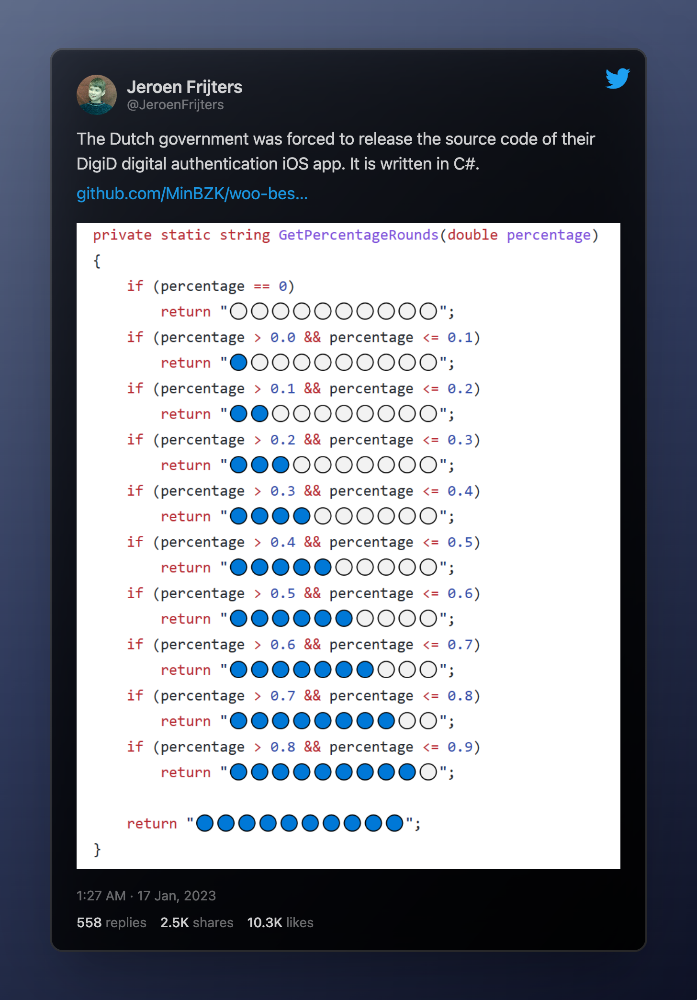
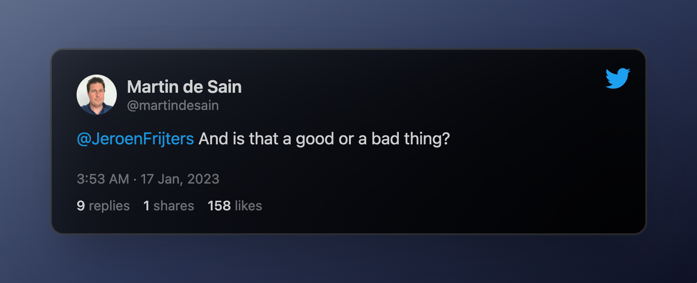
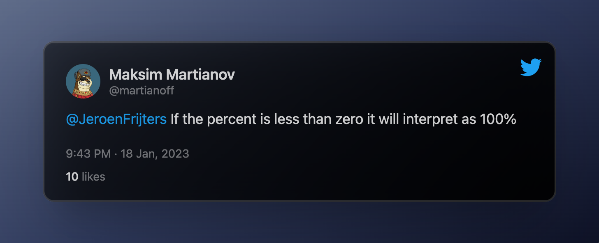
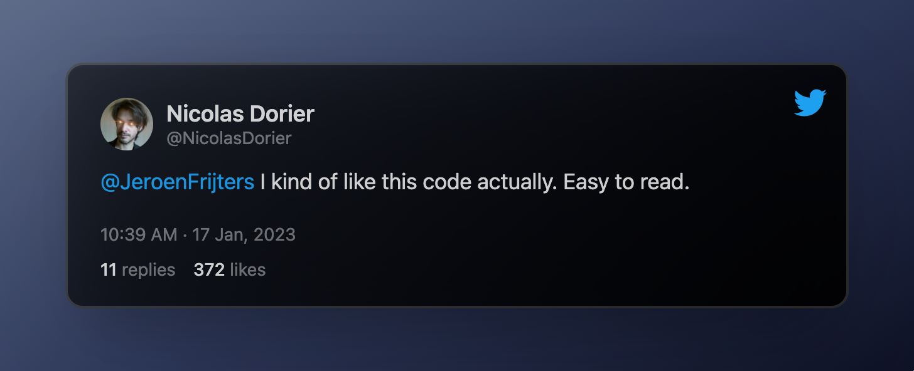
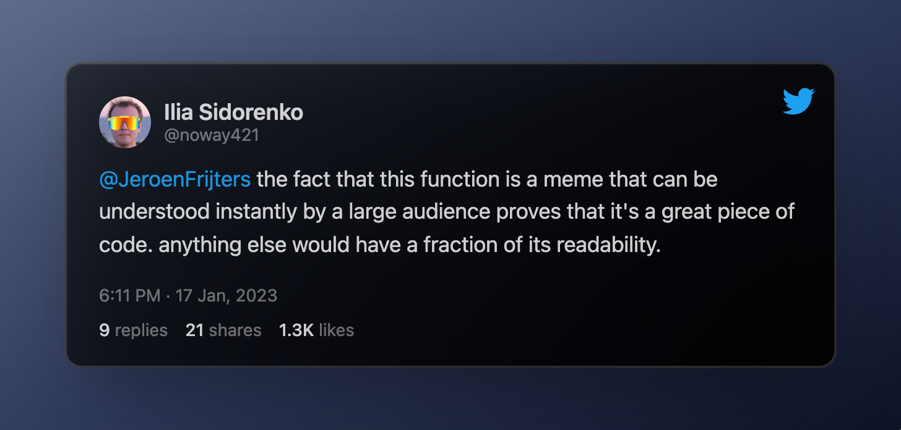
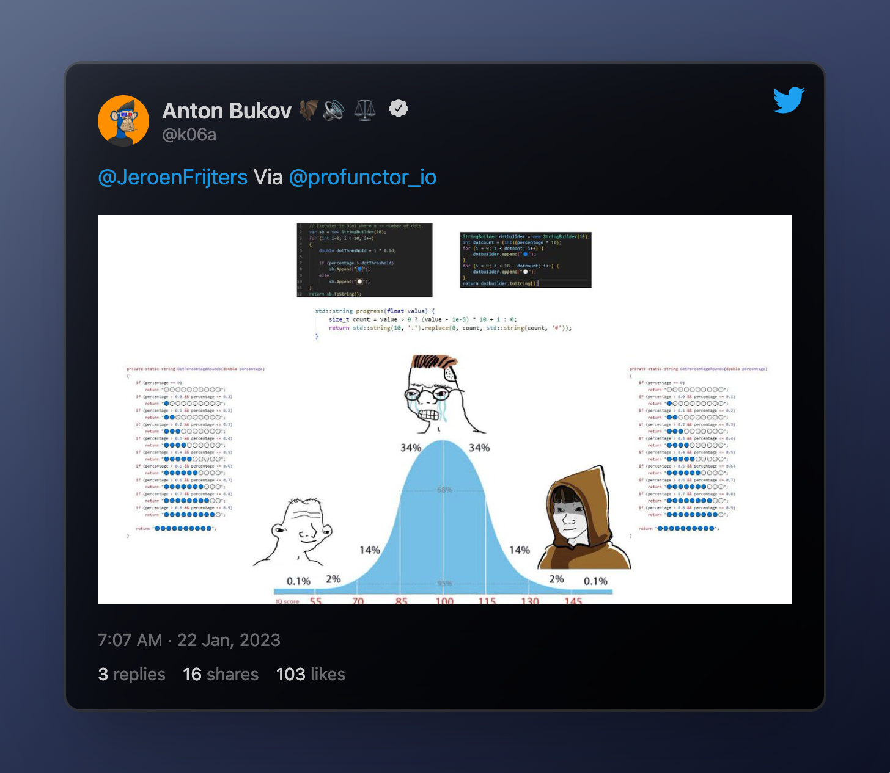
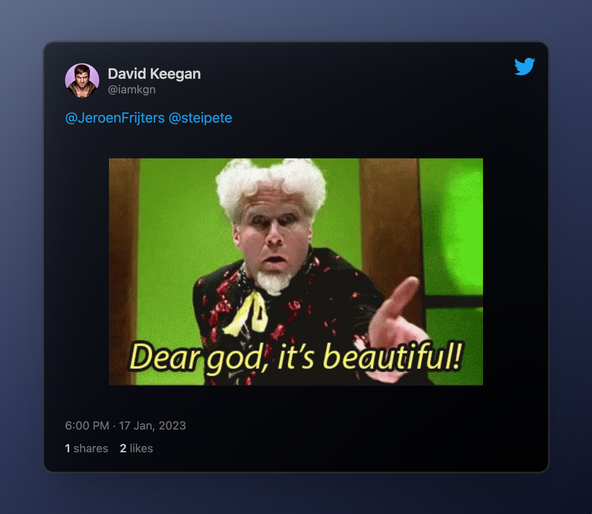

POV estás scrolleando en twitter cuando de repente



**Viral**. Jodas, memes, seriedad, debates de correctitud, complejidad, _readability_ y otros temas que hacen al buen software.

[Link al tweet](https://twitter.com/JeroenFrijters/status/1615204074588180481)

## Selected responses ;)









## Memes





### In My Humble Opinion

La cosa nace con un repo al código de alguna aplicación del gobierno neerlandes. Según el tweet, obligado a publicarlo. Algún usuario encontró la función `GetPercentageRounds` en [este archivo](https://github.com/MinBZK/woo-besluit-broncode-digid-app/blob/ad2737c4a039d5ca76633b81e9d4f3f9370549e4/Source/DigiD.iOS/Services/NFCService.cs#L182)

```cpp
private static string GetPercentageRounds(double percentage)
        {
            if (percentage == 0)
                return "⚪⚪⚪⚪⚪⚪⚪⚪⚪⚪";
            if (percentage > 0.0 && percentage <= 0.1)
                return "🔵⚪⚪⚪⚪⚪⚪⚪⚪⚪";
            if (percentage > 0.1 && percentage <= 0.2)
                return "🔵🔵⚪⚪⚪⚪⚪⚪⚪⚪";
            if (percentage > 0.2 && percentage <= 0.3)
                return "🔵🔵🔵⚪⚪⚪⚪⚪⚪⚪";
            if (percentage > 0.3 && percentage <= 0.4)
                return "🔵🔵🔵🔵⚪⚪⚪⚪⚪⚪";
            if (percentage > 0.4 && percentage <= 0.5)
                return "🔵🔵🔵🔵🔵⚪⚪⚪⚪⚪";
            if (percentage > 0.5 && percentage <= 0.6)
                return "🔵🔵🔵🔵🔵🔵⚪⚪⚪⚪";
            if (percentage > 0.6 && percentage <= 0.7)
                return "🔵🔵🔵🔵🔵🔵🔵⚪⚪⚪";
            if (percentage > 0.7 && percentage <= 0.8)
                return "🔵🔵🔵🔵🔵🔵🔵🔵⚪⚪";
            if (percentage > 0.8 && percentage <= 0.9)
                return "🔵🔵🔵🔵🔵🔵🔵🔵🔵⚪";

            return "🔵🔵🔵🔵🔵🔵🔵🔵🔵🔵";
        }
```

Es muy intuitivo pensar que en lugar de tener tantos `if` se podría resolver haciendo algún tipo de cálculo que relacione el porcentaje y la cantidad de bolitas azules que hay que imprimir.

## Handshake 🤝

Antes de profundizar en cómo hacer al algoritmo “mejor” podemos ver el **contrato** que origina el código.

Imaginemos que somos el rey de Holanda y necesitamos una app. Contratamos una consultora, la consultora tiene un programador, y entre el programador y nosotros generamos un contrato:

_”Necesito que me programes la función `GetPercentageRounds` que toma un porcentaje y me devuelva algo que me ilustre el porcentaje de carga”_

De alguna forma, siempre que un cliente pide algún tipo de software a un programador, implicitamente se firma un contrato. Como en todo contrato, cada parte tiene deberes y obligaciones.

Por un lado el cliente se compromete a dar los inputs necesarios al programador y define qué es lo que espera obtener con el resultado. Por otro lado el programador tiene la obligación de obtener el resultado a partir del input que le dan.

## Correctitud ✅

Imaginemos el contrato que firmaron el rey de Holanda con el programador es algo así: yo me comprometo a darte un `percentage` y vos te comprometes a devolverme un texto que ilustre el estado de carga de mi app.

Muchas críticas que se le hacían al algoritmo era que: _“si el porcentaje es menor a cero lo interprata como 100%”_

Lo cual es claramente un error… o no. Lo cierto es que no importa como lo interprete, siempre y cuando el contrato haya sido claro en qué iba a recibir y qué iba a devolver.

En el colegio de programadores esta es la regla de oro: si los parámetros de entrada no cumplen con el contrato que habíamos acordado, no tengo responsabilidad en el resultado que tenga el programa.

Volviendo al ejemplo, si el cliente y el programador se habían puesto de acuerdo en el que el input era un porcentaje definido como:

$$
p \in \mathbb{R} : 0 \leq p \leq 1
$$

<aside>
⚡ Usar expresiones matemáticas y fórmulas lógicas evita ambigüedades

</aside>

Y luego alguien llama a la función con un valor de `percentage` que no cumple con lo pactado, no importa, o no está definido cómo debe actuar el algoritmo. BTW parece lógico pensar en un porcentaje como un número entre 0 y 1 (o entre 0% y 100%)

Ahora imaginemos que la función de la polémica se usa así:

```cpp
// antes de evaluar se pregunta por validez de p
private static string loading_with_printing() {
	float p = getPorcentageDeCarga()
	if (p < 0 || p > 1) {
		return OtraCosa(p)
	}
	else {
		return **GetPercentageRounds**(p)
	}
}
```

Entonces no tendría sentido, como se proponía en algunas respuestas al tweet, incluir un if dentro de `GetPercentageRounds` que verifique que el parámetro de entrada es $0 \leq p \leq 1$ pues nunca se llegaría a correr la función.

Por lo tanto, y acá va otra del colegio de programadores, no podemos decir que el código original está bien o mal, sino que **depende** del contrato firmado entre el programador y el cliente.

## Buenas prácticas 🧹

Lo siguiente que queda es ver si el código cumple con las buenas prácticas normalmente definidas al momento de programar.

### Readability

Arranco por esta porque es la más fácil. Sí, se lee muy fácil y se entiende muy rápido qué es lo que la función hace. 10/10

### Lines of code

0/10. Otra _rule of thumb_ de la programación: si tenés muchas lineas duplicadas o que hacen cosas muy parecidas, hay lugar para achicar.

Esta también es obvia: en vez de hardcodear cada posible escenario y crear una rama `if` para cada uno de ellos, se puede deducir la cantidad de bolitas azules que hay que imprimir en base al porcentaje. En las respuestas hay bastantes _one-line-solution_ que usan esta idea.

### Complejidad

Esta ya no es tan directa como las otras dos y quizas es más sutil. Imaginemos que queremos mantener el 10/10 en readability, se podría mejorar el código para que sea más eficiente.

Con eficiente nos referimos a la cantidad de operaciones que tiene que hacer la computadora para obtener un resultado. Normalmente se hace en términos asintóticos con la [notación Big O](https://www.freecodecamp.org/news/big-o-notation-why-it-matters-and-why-it-doesnt-1674cfa8a23c/)

Sin embargo no hace falta entrar en tanto análisis en este caso. Recuerdo el código:

```cpp
/* Código original */
private static string GetPercentageRounds(double percentage)
        {
            if (percentage == 0)
                return "⚪⚪⚪⚪⚪⚪⚪⚪⚪⚪";
            if (percentage > 0.0 && percentage <= 0.1)
                return "🔵⚪⚪⚪⚪⚪⚪⚪⚪⚪";
            if (percentage > 0.1 && percentage <= 0.2)
                return "🔵🔵⚪⚪⚪⚪⚪⚪⚪⚪";
            if (percentage > 0.2 && percentage <= 0.3)
                return "🔵🔵🔵⚪⚪⚪⚪⚪⚪⚪";
            if (percentage > 0.3 && percentage <= 0.4)
                return "🔵🔵🔵🔵⚪⚪⚪⚪⚪⚪";
            if (percentage > 0.4 && percentage <= 0.5)
                return "🔵🔵🔵🔵🔵⚪⚪⚪⚪⚪";
            if (percentage > 0.5 && percentage <= 0.6)
                return "🔵🔵🔵🔵🔵🔵⚪⚪⚪⚪";
            if (percentage > 0.6 && percentage <= 0.7)
                return "🔵🔵🔵🔵🔵🔵🔵⚪⚪⚪";
            if (percentage > 0.7 && percentage <= 0.8)
                return "🔵🔵🔵🔵🔵🔵🔵🔵⚪⚪";
            if (percentage > 0.8 && percentage <= 0.9)
                return "🔵🔵🔵🔵🔵🔵🔵🔵🔵⚪";

            return "🔵🔵🔵🔵🔵🔵🔵🔵🔵🔵";
        }
```

En cada `if` la computadora tiene que preguntar si el porcentaje es mayor que un cierto número y menor-igual que otro cierto número. En el peor de los casos, estará preguntando 19 veces (1 en el primero y 2 en cada uno de los 9 if restantes).

Una alternativa posible que mejora la cantidad de preguntas es:

```cpp
/* código alternativa */
private static string GetPercentageRounds(double percentage)
        {
            if (percentage == 1)
                return "🔵🔵🔵🔵🔵🔵🔵🔵🔵🔵";
            else if (percentage >= 0.9)
                return "🔵🔵🔵🔵🔵🔵🔵🔵🔵⚪";
            else if (percentage >= 0.8)
                return "🔵🔵🔵🔵🔵🔵🔵🔵⚪⚪";
            else if (percentage >= 0.7)
                return "🔵🔵🔵🔵🔵🔵🔵⚪⚪⚪";
            else if (percentage >= 0.6)
                return "🔵🔵🔵🔵🔵🔵⚪⚪⚪⚪";
            else if (percentage >= 0.5)
                return "🔵🔵🔵🔵🔵⚪⚪⚪⚪⚪";
            else if (percentage >= 0.4)
                return "🔵🔵🔵🔵⚪⚪⚪⚪⚪⚪";
            else if (percentage >= 0.3)
                return "🔵🔵🔵⚪⚪⚪⚪⚪⚪⚪";
            else if (percentage >= 0.2)
                return "🔵🔵⚪⚪⚪⚪⚪⚪⚪⚪";
            else if (percentage >= 0.1)
                return "🔵⚪⚪⚪⚪⚪⚪⚪⚪⚪";
						else
	            return "⚪⚪⚪⚪⚪⚪⚪⚪⚪⚪";
        }
```

En este caso, en el peor de los casos se realizan 10 preguntas, lo cual mejora la eficiencia del algoritmo sin perder readability.

## Conclusión

Sin saber el contrato que dio origen al código no podemos decir si era correcto o no. En principio parece que sí lo era (tampoco era tan complejo). Lo que sí se podía analizar y mejorar era la estructura de los if para evitar hacer comparaciones innecesarias.

Personalmente no creo que lo primero que se me ocurra para resolver un problema de este tipo es hardcodear cada posible resultado sino intentar armar alguna función que cuente la cantidad de bolitas azules segun el porcentaje. Pero banco al dutch coder padre de esta obra.
