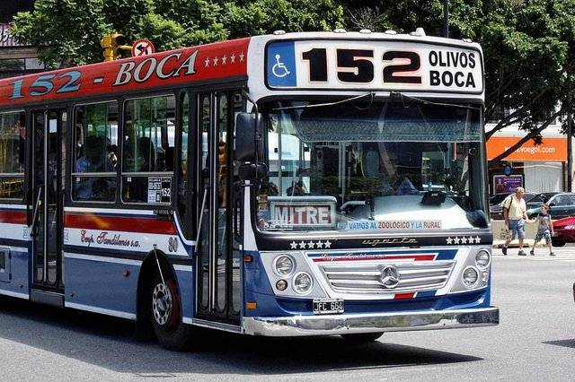
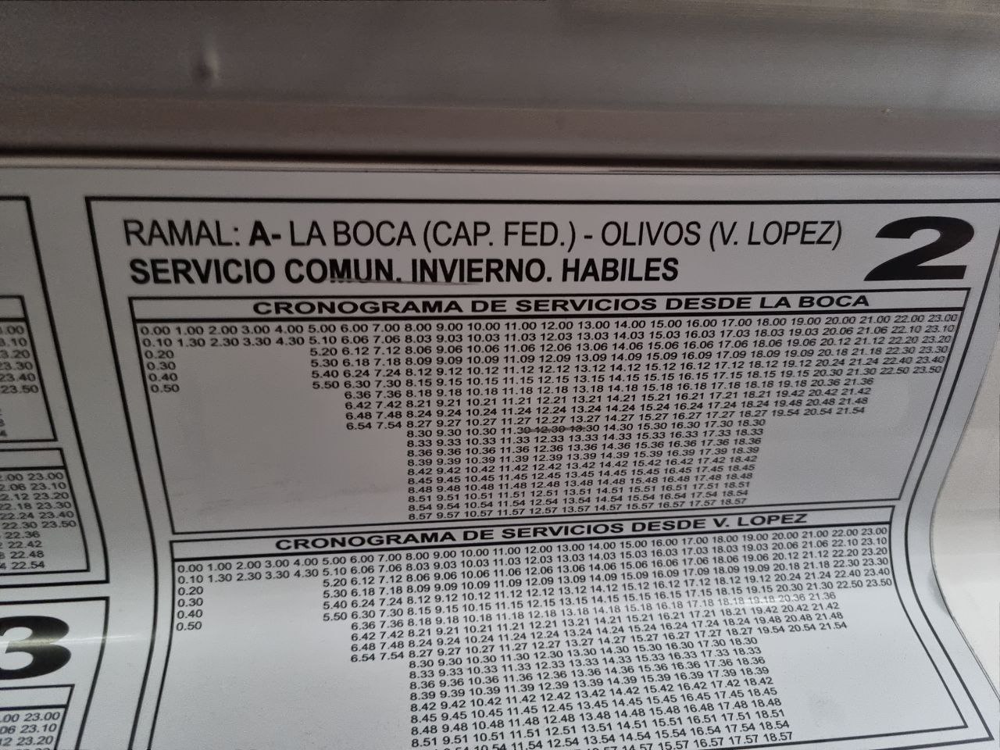
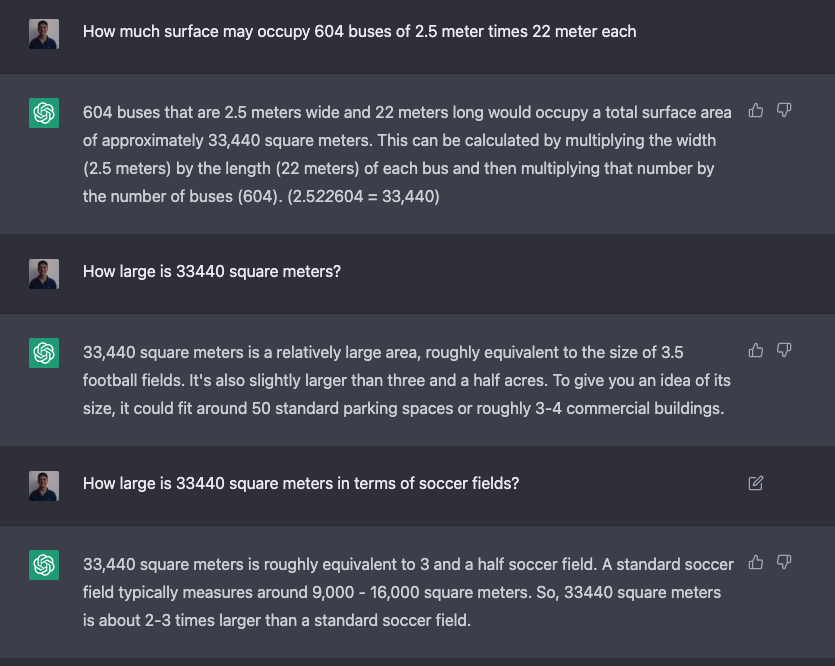
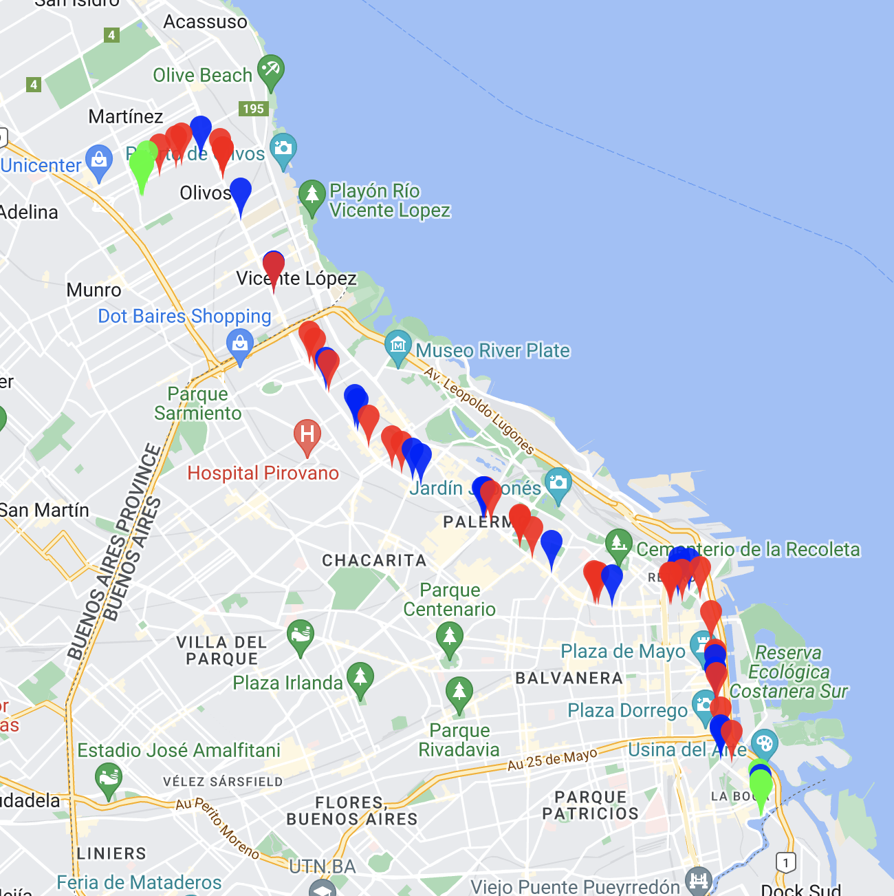
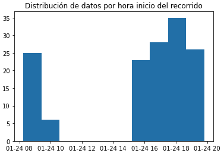
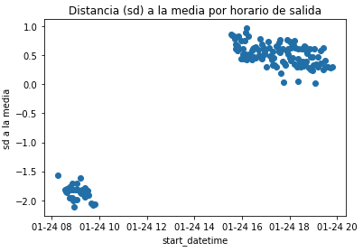
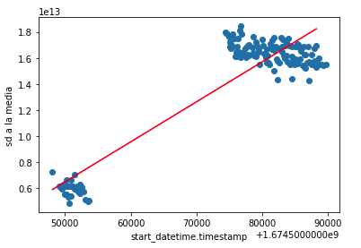

Si alguna vez llegaste a conocer la [Avenida Santa Fe](https://es.wikipedia.org/wiki/Avenida_Santa_Fe) de Buenos Aires, o su continuación en Cabildo-Maipú, seguro te cruzaste con uno (o muchos) colectivos de la línea 152 como los de la foto.

Recorrido super simple: Olivos - La Boca todo derecho por Paseo Colón - Leandro N. Alem - Santa Fe - Cabildo - Maipú

Y seguramente también habrás notado que es más probable cruzarte tres colectivos uno atrás del otro que encontrar uno solo. **La frecuencia es 10/10**.



## Una tarde sin batería

Una tarde sin batería en el teléfono, volviendo de Vicente López, me tomo el 152 y como no tenía el teléfono para scrollear alguna app, me puse a _divagar_ (super recomendable de vez en cuando) y en una de esas encontré este cartel pegado en una pared del bondi:



Yo sabía que la frecuencia era buenísima y medio este cartel lo confirmaba. Entre las 8 y las 19 sale un bondi cada tres minutos, una locura 🤯

Así que me pregunté,

> 🤔 ¿Cuántos bondis serán necesarios para poder cubrir todo el cronograma de frecuencias?

Le saqué una foto al cartel y me llevé la tarea de intentar responder la pregunta.

## Fabricando la respuesta 🔧

Creo que esa misma noche empecé a imaginar una respuesta a la pregunta, o al menos, a hacer otras preguntas que me permitan responder la original, como:

1. ¿Dónde están las cabeceras del recorrido?
2. ¿Cuánto tarda un colectivo en hacer el recorrido entre cabeceras?
3. ¿Cómo influye el tráfico en la duración del recorrido?

También me puse a pensar que bien pudo haber sido la misma pregunta que el/los dueños de la empresa se tuvieron que hacer luego de definir el cronograma de frecuencias y por lo tanto, determinar la cantidad **mínima** de colectivos que pudieran cumplir con el cronograma era lo mejor para el negocio.

Entonces no es solo encotrar una respuesta que sea válida, sino que hay una idea de _optimización_, buscar la mínima cantidad de colectivos que cumplen lo pedido.

### Respuesta 1: naive

La primer respuesta, la llamo _naive_ (ingenua) es tener un colectivo para cada horario de salida, de esa forma me aseguro tener un colectivo disponible para cada salida en el cronograma.

Luego, contando la cantidad de salidas del cronograma, se necesitarían 302 colectivos de ida y 302 colectivos de vuelta, 604 colectivos en total.

Le pregunté a chat GPT cuanto espacio ocupan 604 colectivos, pensando en que en algún lugar se tendrían que estacionar:



Se necesitarían más de tres canchas de futbol para estacionar 604 colectivos, un montón. Inviable desde el espacio, además parece lógico pensar que los colectivos se pueden reutilizar.

### Respuesta 2: reutilizando colectivos

Esta es la idea más lógica, tengo un colectivo que hace el recorrido de punta a punta y cuando llega al final arranca en sentido contrario.

Ahora sí, para poder usar esta estrategia hay que conocer cuánto se tarda en hacer el recorrido de punta a punta.

#### Cronometrando el recorrido

Para poder saber cuánto tarda un colectivo en hacer el recorrido, bien podría haberme tomado uno (o varios) colectivos desde la terminal y cronometrar cuánto tarda en llegar al final del recorrido.

Es muy fácil ver que es un método bastante ineficiente, debe haber algo mejor.

Hace un tiempo, por otro tema, encontre las [API publicas del GCBA](https://buenosaires.gob.ar/desarrollourbano/transporte/apitransporte) que en particular permiten **ver la posición en tiempo real** de los colectivos circulando por la capital/GBA.

> 💡 Si tengo la posición geográfica de los colectivos, puedo calcular cuanto tardan en relizar el recorrido de punta a punta.

La API toma una línea de colectivos y devuelve la posición gps (latitud, longitud) de todos los colectivos de esa línea en tiempo real.



Mapa de colectivos línea 152 del 23/01/2023 a las 20:15hs

En el mapa se ven los colectivos:

- Rojo hacia Olivos
- Azul hacia La Boca
- Verde en terminal

#### Bot the data 🤖

Esa noche (23/01/2023) me quedé programando un bot que hiciera lo siguiente:

1. Llame a la API del GCBA
2. Tome la respuesta y extraiga las posiciones de los colectivos
3. Guarde las posiciones en un csv

El bot quedó corriendo el 24/01/2023 entre las 8 y las 10 y entre las 15 y las 20 horas cada 30 segundos.

#### Gimme the data

Una vez obtenida toda la información, en bruto, quedaba analizarla y sacar conclusiones, había que responder la pregunta: **¿Cuánto tarda un colectivo en realizar el recorrido de punta a punta?**

Empiezo a analizar los datos y me encuentro lo siguiente:



Ok como esperaba, tengo datos entre las 8 y las 9 y pico; y luego entre las 15 y las 20 horas.



Este gráfico era más interesante, me mostraba la distancia en desvios estándar a la media de duración del recorrido para cada viaje, según el horario de salida (start_datetime).

Permitía identificar dos grupos de datos bien claros, los viajes de la mañana con duración bastante menor a la media y los de la tarde con duración por encima de la media. Es decir, los colectivos de la mañana tardaban menos, influenciado seguramente por el tránsito.

#### Clusterizando horarios

Para no complicarme mucho, dividí el horario del recorrido en 3 intervalos:

1. poco tráfico: entre las 22 y las 10
2. medio tráfico: entre las 10 y las 16
3. mucho tráfico: entre las 16 y las 22

Luego para el 1er y 3er intervalo podía usar los datos reales, calcular la media de cada grupo.

Quedaba conseguir la duración media para la franja entre las 10 y las 16. Para calcularlo armé un regresor lineal simple con los datos, obteniendo:



En rojo: regresión lineal simple aplicada a los datos. La recta roja es la que mejor se ajusta a los datos.

Y usando el resultado llegue a determinar el tiempo medio de la 2da franja

Así, los datos de duración media del recorrido quedaron:

1. 22hs - 10hs: 1.64hs
2. 10hs - 16hs: 4.02hs
3. 16hs-22hs: 4.57hs

#### Calculando colectivos

Ahora quedaba lo más fácil, sabiendo los horarios de partida y la duración del recorrido para cada horario, contar la cantidad de colectivos necesarios.

Lo simulé en python:

```python
# Simulación de un día de línea 152
minuto = 0
necesarios = 0
en_terminal = 0
en_recorrido = set()
salidas = get_salidas()
while minuto < 1440:
    if hay_llegada(minuto, en_recorrido):
        en_recorrido.remove(minuto)
        en_terminal += 1
    if hay_salida(minuto, salidas):
        if en_terminal == 0:
            necesarios += 1
            en_terminal += 1
        agregar_llegada(en_recorrido, tiempo_llegada(minuto))
        en_terminal -= 1
    minuto += 1
```

Luego, **hacen falta 81 colectivos, por recorrido, para cumplir con el cronograma de salidas del 152.**

### Conclusiones

Con la segunda estrategia, se logra bajar la cantidad de colectivos de 604 a 162, bastante mejor :)
