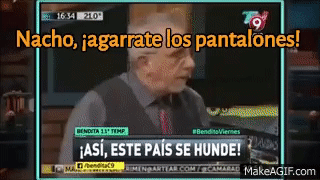
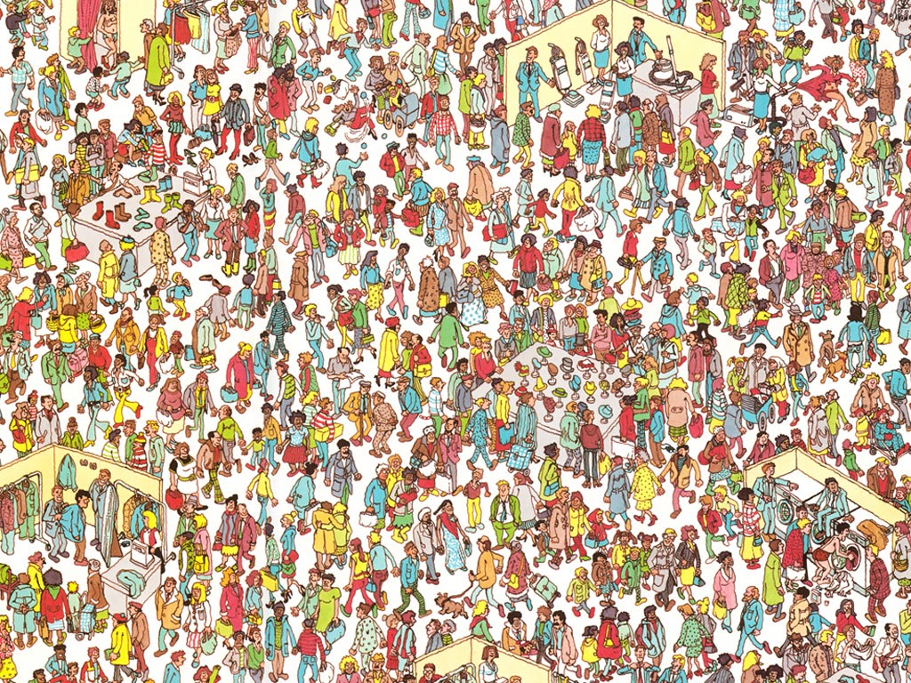

Hace un mes aprox me confirmaban que iba a ser parte del [PSE Core Program](https://pse.dev/en/programs). Un programa de la Ethereum Foundation de 8 semanas que busca educar en criptografía a estudiantes universitarios.

La semana que viene arranca el PSE Core Program y esta semana (week 0) nos introducimos al mundo de las ZK proofs y asentamos algunas bases. Mi idea es ir presentando algunos temas y dejando algunas reflexiones semana a semana. No solo me sirve a mi para asentar conocimientos, sino también puede servir para aquellos que estén interesados en el tema.

:::info
Mi idea es hacer una serie de post de criptografía con temas que me interesen. Los vas a poder identificar por el prefijo **Criptografía |** en el título.
:::

A veces pienso que está todo creado, que ya nada puede ser inventado, y luego aparecen cosas como las zk proofs que te dejan pensando "cómo algo así puede ser posible?"

Algo parecido me pasó la primera vez que escuché sobre bitcoin y peor aún cuando leí el [paper](https://bitcoin.org/bitcoin.pdf).

Y si no te interesa, por lo menos lee este post que te va a dejar volando la cabeza, y si te llamás Nacho: **'Nacho, ¡agarrate los pantalones!'**

## ¿Donde está Wally?

Donde está Wally es un libro que tiene imágenes como la de abajo (un quilombo de gente y cosas basicamente) y en la que tu objetivo es encontrar a Wally, un npc en toda regla.

Si de pibe lo conociste y lo jugaste, seguro hayas pasado un buen rato buscandolo, más del que te gustaría admitir.

Quizás en algún momento llegaste a pensar si Wally realmente estaba en la imagen o el libro/autor/editorial te estaba cagando.

### Wally a juicio

Imaginate que sos el hijo de un abogado y le decís a tu viejo que Wally no está en el libro que te compraron, obvio tu viejo lleva a Wally (a la editoria) a juicio.

El jucio es bien fácil, la editorial tiene que probar que Wally se encuentra en la página en la que estabas jugando. Pero hay algo más: como vos no querés que te caguen la sorpresa, la editorial no puede revelar en que posición de la página se encuentra Wally.

### Wait... Wtf?

Demostrar que Wally está, pero sin decir donde está? Parece imposible, pero el abogado defensor además de abogado es un entusiata matemático (nada más alejado de la realidad).

Se le ocurre lo siguiente, poner una gran sábana con un agujero bien chiquito en el centro. Detras de la sábana, colocar la página del libro, alineando justo la cara de Wally con el agujero de la sábana.

Presenta este _set up_ en el juicio y mirando por el agujero, tu viejo se de que Wally está en la página, y además no revela en que parte de la página está para que vos puedas jugar a encontrarlo.

Este es el ejemplo canónico de una Zero Knowledge Proof.

:::info
Si no encontraste a Wally, está arriba a la derecha.
:::

Acá van otros experimentos mentales:

1. [Two balls and the colour-blind friend](https://en.wikipedia.org/wiki/Zero-knowledge_proof#Two_balls_and_the_colour-blind_friend)
2. [The Ali Baba cave](https://en.wikipedia.org/wiki/Zero-knowledge_proof#The_Ali_Baba_cave)

## ZK Proofs

Ahora sí, de lleno en ZK. Espero que los ejemplos anteriores te hayan motivado y ahora estés en modo "Ohhh ok... interesante".

**Una Zero Knowledge Proof es un método criptográfico para probar que algo es cierto, sin revelar ningún tipo de información extra.**

Otro ejemplo canónico de lo que NO es una ZK Proof podría ser el caso en que con tus 18 años recién cumplidos, vas a un boliche con tus amigos. Lllegás a la puerta y el guardia te pide el DNI. En realidad lo que busca es validar que sos mayor de 18 años para poder entrar. Pero en ese proceso, además de verificar tu edad, le **revelas otros datos sensibles como tu número de documento y tu dirección**.

En realidad, en ese momento solo querés demostrar que sos mayor de 18, sin revelar ningún tipo de información extra, una ZK proof sería ideal.

En toda ZK existen dos tipos de personas: un _prover_ aquel que quiere probar algo, y un _verifier_, aquel que verifica si el _statement_ del prover el verdadero.

### Propiedades

Mi idea no era meterme en teoría, pero es obligatorio nombrar las tres propiedades que tiene que cumplir una ZK proof:

1. **Completeness**: Si un statement es verdadero, el prover debe poder convencer al verifier de que el statement es verdadero. Muchas veces implica que la probabilidad de dar algo como verdadero siendo falso sea muy baja.
2. **Soundness**: Si un statement es falso, no existe un prover engañoso que pueda convencer al verifier de que la declaración es verdadera, de nuevo con un margen de error muy pequeño.
3. **Zero Knowledge**: Si el statement es verdadero, el verifier no aprende nada más que este hecho.

:::info
Si querés saber más desde lo teórico fijate [este blog post](https://blog.cryptographyengineering.com/2014/11/27/zero-knowledge-proofs-illustrated-primer/)

Te recomiento que intentes entender cómo se prueba la última propiedad.
:::

### Interactive vs non-interactive

Esta es una categorización que me parece interesante. Si pudiste ver los ejemplos de ZK que dejé arriba, seguro viste el de La Cueva de Alibaba. Seguro viste que la idea de la prueba es ir preguntando varias veces lo mismo como para ver si en alguna de esas preguntas el prover se da una respuesta falsa y podemos determinar que el statement es falso.

Esa idea se repite varias veces en un montón de ejemplos: imaginate que alguien te dice que es un crack adivinando cosas, como el clima, seguramente la mejor forma de probarlo sea preguntandole todos los días ¿Cómo va a estar el clima mañana?. Mientras más predicciones se cumplan, mayor será tu confianza en que esa persona realmente predice como va a estar el clima.

En ZK es lo mismo, a medida que repetimos experimentos y el prover siempre responde satisfactoriamente, vamos generando confianza en que sabe de lo que está hablando, esas son las **interactive proofs**.

Ahora surge el problema con el que siempre nos encontramos los programadores, se puede mejorar/eficientizar eso? Tener que repetir muchas veces un experimento para convencernos de que algo es cierto no parece muy económico (no lo es).

De allí surge la necesidad de las **non-interactive** proofs. En estas, por medio de un único experimento nos podemos convencer de que el statement es cierto.

Acá otra vez un ejemplo canónico que a mi me sorprendió una banda cuando lo leí: [Zero-Knowledge Proof For Sudoku Using Standard Playing Cards](https://www.wisdom.weizmann.ac.il/~naor/PAPERS/SUDOKU_DEMO/). Dale, anda a leerlo y después volvé.

Este ejemplo es _non-interactive_ porque el prover y el verifier solo se intercambian un mensaje, que alcanza para probar que el tablero del sudoku está completo.

:::info

- Interactive -> varios intercambios de mensajes entre prover y verifier
- Non-interactive -> con un solo mensaje alcanza para hacer la prueba
  :::

## Casos de uso

Hay un post muy bueno de casos de uso de ZK proofs en Ethereum: [Use-cases for zero-knowledge proofs](https://ethereum.org/en/zero-knowledge-proofs/#use-cases-for-zero-knowledge-proofs) así que como el post se me está alargando bastante voy a dejar que lo revises por tu cuenta.

Además en el último tiempo se estuvo trabajando en el desarrollo de [zk-rollups](https://ethereum.org/es/developers/docs/scaling/zk-rollups/) que permiten usar ZK para validar las transacciones de una [Layer 2](https://ethereum.org/en/layer-2/), permitiendo escalar Ethereum.

Pero más aún, Aztec está desarrollando lo que llaman [ZK-ZK-Rollup](https://azt3c-st.webflow.io/blog/aztecs-zk-zk-rollup-looking-behind-the-cryptocurtain) (sostienen que las actuales zk rollups no son tan zk), permitiendo ocultar todos los inputs y outputs de una transacción en la blockchain. Yo me quedé así cuando lo escuché 🤯

Si querés saber más, mirate [esta charla de Santiago Palladino](https://youtu.be/f1AD_pbBRCM?t=6664)

## ¿Cómo me meto en este mundo?

En principio tenés que saber algunas cosas matemáticas bastante simples. Yo te voy a tirar algunos temas como para que bayas googleando

1. Números primos
2. Factorización de enteros
3. Aritmética modular
4. Grupos y generadores
5. Algo de programación general

Para la parte de programación, te recomiendo como siempre el [CS50 de Harvard](https://www.edx.org/cs50) que es un poco largo pero vale la pena 100%.

Despues de eso, lenguajes de programación hay muchos, pero recomiendo que sepas algo de Javascript: [este curso de freecodecamp](https://www.freecodecamp.org/learn/javascript-algorithms-and-data-structures-v8/) puede ser una buena opción.

En cuanto a lo matemático, si bien es un poco más dificil de aprender online, te puedo recomendar dos cosas buenas que nos dejo la pandemia:

1. El fasciculo 9, material de la materia Álgebra I de las carreras de exactas de la UBA. [Acá está](https://cms.dm.uba.ar/depto/public/grado/fascgrado9.pdf)
2. [Este canal de youtube](https://www.youtube.com/@AlgebraIC-gu7oc) que tiene todas las clases del primer cuatrimestre 2021

Creo que con el capítulo 3 y 4 del fascículo 9 debería ser sufuciente base algebráica, pero si tenés tiempo y ganas estudialo todo que está buenísimo.

Salu2.
