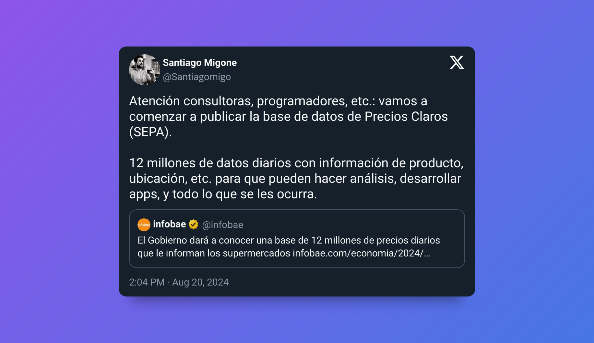

Simplemente encontré este tweet que desbloqueó algunos recuerdos y merecen un post.

[Link al tweet](https://x.com/Santiagomigo/status/1825941904724472214)

Hace un par de meses me independicé de la casa de mis viejos, comenzando toda la movida de vivir solo, particularmente la relacionada a las compras. Una de las primeras decisiones que tuve que tomar fue: a qué supermercado ir, cada cuánto ir (todos los días, una vez por semana, una vez al mes, etc), cómo pagar (descuentos y promos).

Y claro, los principios de economía que alguna vez se vieron en la facultad se comienzan a sentir en la realidad: quería ir al supermercado que me permita comprar todos los productos que quería al menor costo posible.

Lo primero que me di cuenta es que tenía a una distancia razonable un Coto, Disco y Carrefour. Todos hipermercados por lo que no tenía problemas de surtido, todo lo que había en mi lista iba a estar en cualquiera de los tres.

El problema era determinar el costo de lo que iba a terminar pagando en cada caso, imposible saber. Además, existe un sin fin de promociones bancarias con límites semanales o mensuales, con ciertas tarjeta de crédito y aplicable en ciertos días. Al final, si quería pagar lo menos posible tenía que ir a X supermercado, el día Y y pagando con la tarjeta Z del banco W (a través de MODO, claro).

Rápidamente desistí de hacer el análisis fino y terminé eligiendo ir al que me quedaba más cerca. Siempre me pareció que había una oportunidad ahí, poder usar la teconología para dar acceso a la información al consumidor.

## La medida

Según anucian desde el gobierno, parece que este jueves 22 de agosto 2024 se va a empezar a publicar una base de datos de precios diarios, como para que el yo de hace unos meses pueda hacer su lista del super y ver en que supermercado le conviene hacer la compra. Un sueño hecho realidad.

Y lo mejor de todo, lo apuntan a desarrolladores, analistas, consultoras, etc. Se abre un abanico gigante de usos y aplicaciones que se pueden desarrollar con esta información. Algunas ideas que se me vienen a la mente:

1. Arma tu lista del super y fijate donde comprar más barato
2. Índices de precios diarios que no se basen en bots que scrapean webs
3. Análisis de conveniencia de promociones bancarias
4. Análisis de competitividad y oportunidades de negocio en ciertos productos.

## Back to macroeconomía

A todos los que estudiamos en alguna facultad de ciencias económicas, bien temprano en la carrera nos presentan los ✨mercados de competencia perfecta✨. Los mercados de competencia perfecta son aquellos en los que se cumplen:

1. La existencia de un elevado número de productores y consumidores.
2. Las empresas vendan un producto homogéneo en el mercado.
3. **Las empresas y los consumidores tengan información completa, gratuita y simétrica.**
4. No haya barreras de entrada o salida al mercado.
5. Movilidad perfecta de bienes y factores.
6. Sin costos de transacción.

:::info
Más info de los mercados de competencia perfecta en [Competencia perfecta | Wikipedia](https://es.wikipedia.org/wiki/Competencia_perfecta)
:::

En mi caso personal facultativo, este concepto de competencia perfecta era algo que se veía al principio, como una _abstracción_ del mercado y luego toda la teoría se seguía desde ahí.

El problema, claro, era que la teoría se quedaba en eso mismo porque esta abstracción era poco realista. Por lo menos en mi punto de vista.

Especialmente en Argentina, en donde para todo producto parece haber solo dos productores, los mercados de competencia perfecta parecían imposibles. Ni hablar de la famosa frase "ya no se ni cuanto cuestan las cosas" que hayamos usado (o pensado) todos.

Ojala que precios claros pueda ayudar a mejorar esta competitividad. Los consumidores van a tener la información del supermercado más barato. Los productores van a poder saber cómo se posicionan en precio con sus competidores, los supermercados van a poder ver qué competidores tienen mejores precios.

Gran medida, veremos como se desarrolla, quizás el proximo post sea con la app que calcule el menor costo de la lista del super. 🚀
