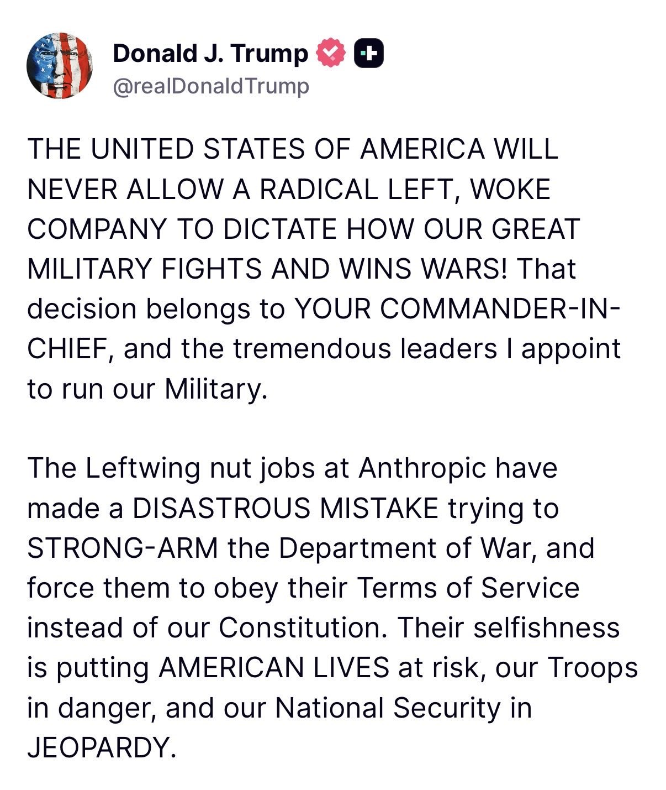

Heyo, it's been a while since the last post. One of my 2026 goals I set up a couple weeks ago is to commit with the blog. So here we go.

New styling, new ideas, same curiosity... that's pretty much what I'm feeling right now as I write this. It's Q1 2026, AI is turning the software industry into madness as new technologies, tools, models, are presented almost every day. Looks like the tooling last week you'd been trying out it's already obsolete. 

It's fun tho, you can see a general madness on twitter, news, friends and family, everyone using AI on so much different domains.

Maybe the most interesting talks we're currently having comes back into guardrailing AI, or guardrailing humans using it. As I write this the new gulf war between USA, and all the Oil big guys agains Irán is taking place, that makes twitter feed full of arabic tweets like this

<blockquote class="twitter-tweet">
بيان مشترك الإثنين 2 مارس 2026  تدين دولة الكويت والمملكة العربية السعودية ومملكة البحرين ودولة قطر والمملكة الأردنية الهاشمية ودولة الإمارات العربية المتحدة والولايات المتحدة الأمريكية، بشدة هجمات الجمهورية الإسلامية الإيرانية العشوائية والمتهورة بالصواريخ والطائرات المسيّرة ضد… <a href="https://t.co/4k44KHXN3b">pic.twitter.com/4k44KHXN3b</a>
&mdash; وزارة الخارجية (@MOFAKuwait) <a href="https://twitter.com/MOFAKuwait/status/2028409014782960036?ref_src=twsrc%5Etfw">March 2, 2026</a></blockquote> 

Thanks Twitter built-in translator

And the gigachads of anthropic wanted to have their very own stake on the war, as they decided to ask the Departament of War not to use their model on autonomous weapons and mass surveilance, both IMO very reasonable. Not for _the peluca_

We will see how this evolves, have to admit that anthropic's move on telling the DOW what they can and cannot do with their model is brave and very reasonable.

For us, the general public, the massive amount of info that every day gets targeted to our non-high-attention minds makes really difficult to understand how all this will affect us. As I read somewhere, all production-realted revolutions, most important the first industrial revolution and more recently the knowledge revolution, had consequences on how us humans organized to produce, to work.

When machines replaced human force, we moved to more administrative labor, when computers arrived, the new knowledge economy emerged, people working behind a screen doing white collar things. Now, we have a new revolution, the one where AI will take our brain-related tasks, what new productive task will us humans be able to do, no clue.

However the speed on which this thing is evolving is madness, so we better find a new thing to do sooner than later.

There is hope tho, as AI still lacks on autonomy and gets lost on large context requests. AI Tutor engineer, soon to come on most linkedin profiles. 

This is a really nice reading on the thing (https://ii.inc/web/the-last-economy)

Til next time fellow dumb human